# Styx OS - Unix-Compatible Browser Kernel (v0.20 "Rivendell")

[](https://www.gnu.org/licenses/gpl-3.0)
[]()
[]()

**Styx OS** is a POSIX-compatible web-native microkernel operating system and desktop runtime executing natively inside modern web browsers using **WebAssembly (WASI 0.1 & WASI 0.2 Component Model)**, **TypeScript**, **Origin Private File System (OPFS)** block storage, and an **OpenAI / Ollama Compatible Local LLM REST & WebSockets Agent Server**.

---

## 🖥️ Desktop & Terminal Interface


---

## 🏛️ Architecture Overview

```mermaid
graph TD
    subgraph ExternalClients ["External Clients & AI Agents"]
        OPENAI_SDK["Python OpenAI / LangChain / AutoGen SDK"]
        CURL_API["curl http://localhost:8080/v1/chat/completions"]
        WS_RPC["WebSockets JSON-RPC (ws://localhost:8080/rpc)"]
    end

    subgraph BrowserUI ["Browser UI & Desktop Layer"]
        XT["Xterm.js Terminal Shell (user@styx:~$)"]
        WM["Graphical Window Manager & Desktop (wm.ts)"]
        GUI_MON["Real-Time Process Monitor GUI (/bin/top-gui.wasm)"]
        GUI_FIND["Visual VFS File Finder Window (files / finder)"]
    end

    subgraph KernelRuntime ["TypeScript OS Kernel Runtime"]
        LLM_SERVER["Local LLM REST/RPC Agent Server (llm-server.ts)"]
        SANDBOX_E["Ollama / Gemma LLM Code Sandbox (sandbox.ts)"]
        WASI_LDR["WASI 0.2 Component Model & WIT Loader (execve.ts)"]
        EXT4_DRV["Virtual EXT4 Block Storage Driver & OPFS Engine (ext4.ts)"]
        SOCKET_PROXY["WebSockets / WebRTC TCP/UDP Proxy Protocol (socket.ts)"]
        POSIX_IPC["POSIX IPC Engine (signal.ts, shm.ts, sem.ts, mutex.ts, lockf.ts)"]
        SECURITY["POSIX Extended ACLs (acl.ts) & Cgroups v2 (cgroup.ts)"]
        SHLIB["Virtual Dynamic Shared Object Loader (shlib.ts, dlopen)"]
        TMUX["Virtual Terminal Multiplexer Engine (tmux.ts)"]
    end

    subgraph StorageLayer ["Virtual Storage & Devices"]
        MEMFS["In-Memory VFS (MemNode / /bin / /tmp)"]
        DEV_SDA["/dev/sda - 64MB OPFS Persistent Block Storage"]
        PROCFS["Virtual /proc & /sys Filesystem Drivers"]
    end

    OPENAI_SDK & CURL_API & WS_RPC <--> LLM_SERVER
    LLM_SERVER <--> SANDBOX_E
    XT & WM & GUI_MON & GUI_FIND <--> KernelRuntime
    KernelRuntime <--> WASI_LDR & EXT4_DRV & SOCKET_PROXY & POSIX_IPC & SECURITY & SHLIB & TMUX
    KernelRuntime <--> MEMFS & DEV_SDA & PROCFS
```



---

## ✨ Key Technical Features in v0.20 "Rivendell"

### 🤖 Local LLM REST/RPC Agent Server (`llm-server.ts`)
- **OpenAI `/v1/chat/completions` API Compatibility:** Point Python OpenAI, LangChain, or AutoGen SDK directly to `http://localhost:8080/v1`.
- **JSON-RPC 2.0 WebSockets Endpoint:** `ws://localhost:8080/rpc` bidirectional real-time event streaming.
- **Kernel Function Call Loop:** Automatically dispatches LLM tool call execution (`run: <command>`) directly into the secure Styx OS kernel sandbox.

### 🪟 Advanced Window Manager, Compositor & Layout Snapping (`wm.ts`, `wm-config`, `files`)
- **Layout Grid Snapping:** `wm-config tile-left`, `wm-config tile-right`, `wm-config maximize`, and `wm-config restore`.
- **Glassmorphism Theme Compositor:** Live CSS backdrop filter toggling (`wm-config glassmorphism on/off`).
- **Interactive VFS File Finder:** GUI File Finder application window (`files` / `finder`) with real-time text/regex search and directory previews.

### 🖥️ Virtual Terminal Session Multiplexer (`tmux.ts`)
- **Session Multiplexing:** Create (`tmux new -s dev`), list (`tmux ls`), detach (`tmux detach`), attach (`tmux attach -t dev`), and terminate (`tmux kill-session -t dev`) persistent terminal sessions.

### 📦 Virtual Dynamic Shared Object Loader & One-Click VFS Backup
- **Dynamic Linker Subsystem (`shlib.ts`):** In-browser `dlopen`, `dlsym`, `dlclose`, and `dlerror` dynamic library symbol linking for Wasm shared objects.
- **One-Click VFS Exporter (`spkg export`):** Recursively exports target VFS directories into `.tar` backup archives with browser host file downloading.
- **POSIX Shell Debugger (`sh -x`):** Line-by-line debug trace output (`+ line [N]: <cmd>`) and variable inspector.

### 💾 Virtual EXT4 Block Storage Driver & OPFS Persistence (`ext4.ts`)
- **`/dev/sda` Block Storage:** 64MB virtual block storage device driver formatted with EXT4 superblock layout (`0xEF53`).
- **Browser OPFS Sync:** Synchronizes raw disk blocks with Chrome/Firefox **Origin Private File System (OPFS)** for long-term file persistence.
- **Disk Utilities:** `fdisk -l` GPT partition tool, `mkfs.ext4` formatter, `mount`, and `umount`.

### 🛡️ POSIX IPC, Cgroups v2 & Security Subsystems
- **Real-Time Signals:** `sigaction`, `sigprocmask`, `sigpending`, `sigsuspend`, `SIGRTMIN`..`SIGRTMAX`.
- **Shared Memory & Semaphores:** `shm_open`, `shm_unlink`, `sem_open`, `sem_wait`, `sem_post`, `ipcs`.
- **Shared Mutices & Spinlocks:** `pthread_mutex_init`, `pthread_mutex_lock`, `pthread_spin_lock`, `mutex`.
- **Record Byte-Range Locking:** `fcntl(F_SETLK)`, `fcntl(F_GETLK)`, `lockf`, `lslocks`.
- **Cgroups v2 Controllers:** `/sys/fs/cgroup`, `memory.max`, `cpu.max`, `pids.max`, `cgcreate`, `cgexec`, `lscgroup`.
- **POSIX Extended ACLs:** `getfacl`, `setfacl -m` / `-x`, per-user and per-group permission matrix.

---

## 🛠️ Complete CLI Command Reference

| Command Category | Active Commands |
| :--- | :--- |
| **Kernel Core & VFS** | `ls`, `cat`, `pwd`, `mkdir`, `rm`, `cp`, `mv`, `stat`, `chmod`, `chown`, `touch`, `date`, `uptime`, `time` |
| **User & Security** | `whoami`, `su`, `sudo`, `getcap`, `setcap`, `ulimit`, `getfacl`, `setfacl` |
| **Process & IPC** | `ps`, `kill`, `top`, `top-gui`, `tmux`, `signal`, `sigaction`, `sigprocmask`, `ipcs`, `shm_open`, `sem_open`, `mutex`, `lockf`, `lslocks` |
| **Storage & Desktop**| `fdisk`, `mkfs.ext4`, `mount`, `umount`, `mknod`, `mkfifo`, `swapon`, `swapoff`, `df`, `free`, `files`, `finder`, `wm-config` |
| **Networking** | `ifconfig`, `curl`, `nc`, `ping`, `socket` |
| **System & Dynamic** | `sysinfo`, `uname`, `dmesg`, `lspci`, `lsusb`, `lscpu`, `hwprobe`, `dlopen`, `syscheck`, `posix-status` |
| **Development & LLM**| `llm-server`, `sandbox`, `spkg`, `spkg export`, `sh -x`, `wasm-info`, `nano`, `vim`, `calc`, `wc`, `draw`, `bench`, `sysbench`, `man` |

---

## 📚 Documentation & GitHub Wiki

Detailed technical documentation, architectural guides, and API specifications are available in the repository wiki:

- 🌐 **Online GitHub Wiki**: [https://github.com/jpferreria/styx/wiki](https://github.com/jpferreria/styx/wiki)
- 🏠 **[Wiki Home](wiki/Home.md)** - Overview, key highlights, and feature catalog.
- 🏛️ **[Architecture & Runtime](wiki/Architecture.md)** - High-level microkernel architecture and WASI Preview 2 Component Model.
- 📋 **[POSIX Subsystems Catalog](wiki/POSIX-Subsystems.md)** - Detailed breakdown of all 77 POSIX milestone subsystems.
- 🚀 **[Getting Started Guide](wiki/Getting-Started-&-Running-Guide.md)** - Quickstart, dev server setup, and control scripts (`./start.sh`, `./status.sh`, `./stop.sh`).
- 📖 **[API & Syscall Reference](wiki/API-&-Syscall-Reference.md)** - System call reference table and kernel module APIs.

---

## 🧪 Test Suite & Code Coverage

- **Vitest Test Suite:** **205 / 205 Tests Passed (100% Success Score)** across 67 test files.
- **Kernel Code Coverage:** **88.08% Statement Coverage** across kernel core modules.

```bash
cd packages/shell-ui
npm test -- --coverage
```

---

## 🚀 Running Locally

1. Navigate to the shell UI workspace:
   ```bash
   cd packages/shell-ui
   ```
2. Run automated Vitest test suite:
   ```bash
   npm test
   ```
3. Build production bundle:
   ```bash
   npm run build
   ```
4. Launch local development server:
   ```bash
   npm run dev
   # Open http://localhost:5180/
   ```

> [!NOTE]
> **Browser Compatibility Note:**
> Styx OS runs fully on all modern browsers (Chrome, Firefox, Edge, Safari). Native host folder mounting (`mount-host` / File System Access API `showDirectoryPicker`) requires Chromium-based browsers (Google Chrome, Microsoft Edge, Brave). Safari/WebKit does not support the File System Access API.

---

## 📄 License

This project is licensed under the **GNU General Public License v3.0 or later (GPL-3.0-or-later Copyleft)**. See `LICENSE` for details.
