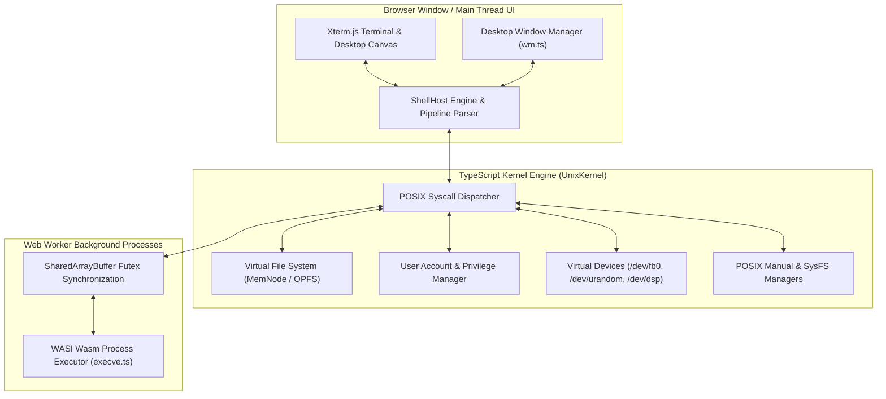

# Styx OS Deep Dive Architectural Documentation

Welcome to the **Styx OS Deep Dive Documentation** directory. This comprehensive technical guide covers the design, POSIX compliance model, 26 implementation milestones, complete test suites, and execution instructions for **Styx OS**.

---

## Document Index

1. [POSIX Standard & Syscall Model (`posix.md`)](file:///Users/jerry/Documents/antigravity/splendid-faraday/deep-dive/posix.md)
   - Deep dive into POSIX IEEE 1003.1 architecture, virtual file descriptors, process isolation, Web Worker futexes, capabilities, and system calls.
2. [Complete Milestones Guide (`milestones.md`)](file:///Users/jerry/Documents/antigravity/splendid-faraday/deep-dive/milestones.md)
   - Detailed chronicle of all **26 development milestones** implemented in Styx OS, from low-level Web Worker process execution to SysFS hardware probes and desktop notification centers.
3. [Test Suite Breakdown (`testing.md`)](file:///Users/jerry/Documents/antigravity/splendid-faraday/deep-dive/testing.md)
   - Comprehensive documentation of all **26 Vitest test files** and **74 automated unit/integration test cases**.
4. [Execution & Setup Guide (`running_guide.md`)](file:///Users/jerry/Documents/antigravity/splendid-faraday/deep-dive/running_guide.md)
   - Step-by-step instructions on running Styx OS locally, executing unit tests, building production assets, hosting static bundles, and packaging standalone desktop apps (Tauri / Electron).

---

## High-Level Architecture Overview

---

## Copyright & License Notice

Copyright (C) 2026 Styx OS Project Authors  
Licensed under the **GNU General Public License v3.0 or later (GPL-3.0-or-later)**.  
See [https://www.gnu.org/licenses/gpl-3.0.html](https://www.gnu.org/licenses/gpl-3.0.html) for full copyleft licensing terms.
