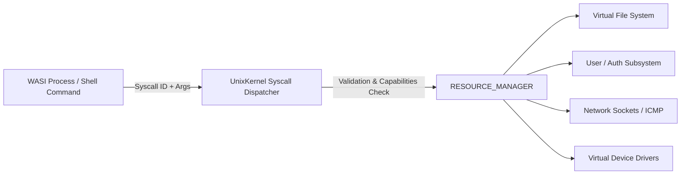

# POSIX Standard & Syscall Model in Styx OS

This document describes the **POSIX (Portable Operating System Interface - IEEE Std 1003.1)** implementation, file descriptor tables, capability security model, and syscall architecture inside **Styx OS**.

---

## 1. What is POSIX?

**POSIX** (Portable Operating System Interface) is a family of standards specified by the IEEE Computer Society for maintaining compatibility between operating systems. POSIX defines standard application programming interfaces (APIs), shell utilities, and system call contracts for Unix-like operating systems.

Styx OS implements a browser-native POSIX-compliant execution environment inside web browsers using TypeScript, Rust WebAssembly (`wasm32-wasi`), and Web Workers.

---

## 2. Styx OS Syscall Architecture

All interaction between WebAssembly process workers, shell pipelines, and system resources is routed through `UnixKernel` syscall dispatchers.

---

## 3. Implemented POSIX System Calls

| Syscall | POSIX Prototype / Signature | Description |
| :--- | :--- | :--- |
| `sys_open` | `int open(const char *path, int flags)` | Opens a file node in the VFS, allocating a file descriptor. |
| `sys_read` | `ssize_t read(int fd, void *buf, size_t count)` | Reads bytes from an open file descriptor at current offset. |
| `sys_write` | `ssize_t write(int fd, const void *buf, size_t count)` | Writes bytes to an open file descriptor. |
| `sys_close` | `int close(int fd)` | Closes an open file descriptor and frees table slot. |
| `sys_pipe` | `int pipe(int pipefd[2])` | Allocates a unidirectional POSIX IPC data pipe (Read/Write descriptors). |
| `sys_dup2` | `int dup2(int oldfd, int newfd)` | Duplicates an existing file descriptor (used for shell stdin/stdout redirection). |
| `sys_execve` | `int execve(const char *pathname, char *const argv[], char *const envp[])` | Loads and executes a WASI WebAssembly application binary in a Web Worker context. |
| `sys_kill` | `int kill(pid_t pid, int sig)` | Sends a POSIX signal (`SIGINT`, `SIGTERM`, `SIGKILL`) to a process PID. |
| `sys_signal` | `sighandler_t signal(int signum, sighandler_t handler)` | Registers a signal trap handler for asynchronous signal events. |
| `sys_socket` | `int socket(int domain, int type, int protocol)` | Allocates a POSIX virtual socket file descriptor. |
| `sys_connect` | `int connect(int sockfd, const struct sockaddr *addr, socklen_t addrlen)` | Connects a virtual socket to a target host domain or IP. |
| `sys_send` | `ssize_t send(int sockfd, const void *buf, size_t len, int flags)` | Transmits data packet over a virtual socket. |
| `sys_recv` | `ssize_t recv(int sockfd, void *buf, size_t len, int flags)` | Receives data buffer from a virtual socket. |
| `sys_getenv` | `char *getenv(const name)` | Fetches value of an environment variable from `/etc/environment`. |
| `sys_setenv` | `int setenv(const char *name, const char *value, int overwrite)` | Modifies or adds an environment variable. |
| `sys_unsetenv`| `int unsetenv(const char *name)` | Deletes an environment variable. |

---

## 4. File Descriptor Table & Standard Streams

Every process thread maintains a POSIX file descriptor table:

- **Descriptor `0` (`/dev/stdin`):** Standard Input stream.
- **Descriptor `1` (`/dev/stdout`):** Standard Output stream.
- **Descriptor `2` (`/dev/stderr`):** Standard Error stream.
- **Descriptors `3+`:** User opened files, pipes, sockets, and device drivers.

---

## 5. File System Permissions & Octal Modes

Styx OS enforces standard POSIX file permission bits:
- **`0o755` (`rwxr-xr-x`):** Executable directories and system binaries.
- **`0o644` (`rw-r--r--`):** Regular system configuration files (`/etc/passwd`, `/etc/environment`, `/etc/hosts`).
- **`0o600` (`rw-------`):** Sensitive shadow user files (`/etc/shadow`).
- **`0o666` (`rw-rw-rw-`):** Stream device drivers (`/dev/tty`, `/dev/null`, `/dev/zero`, `/dev/urandom`).
