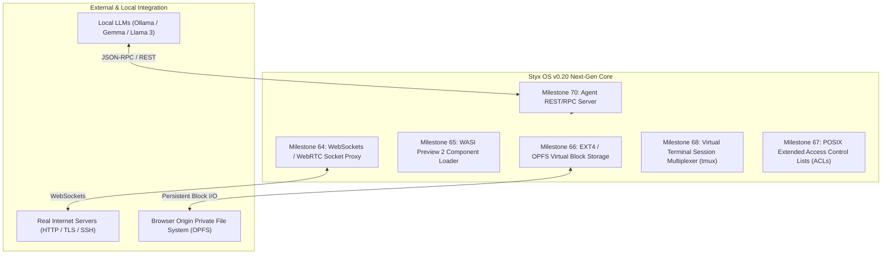

# Styx OS Roadmap: Version 0.20 "Rivendell" (Milestones 62 - 71)

## Executive Summary
**Styx OS v0.10** established a robust POSIX-compliant WebAssembly operating system with 60 core subsystems (VFS, ProcFS, SysFS, DevNodes, Termios, MMap, IPCCleanup, High-Res Timers, Capabilities, Resource Limits, SysInfo, Poll/Epoll, and LLM Code Execution Sandbox).

**Styx OS v0.20 "Rivendell"** (named after the legendary sanctuary of safety, wisdom, and protection) expands Styx OS into a production-grade WebAssembly desktop workstation and autonomous AI sandbox. Version 0.20 introduces **browser-native socket proxying**, **EXT4/OPFS virtual block storage**, **WASI Preview 2 component support**, **POSIX ACLs**, **tmux terminal multiplexing**, and a **dedicated Local LLM RPC Server**.

---

## Cron Availability Status in v0.10

> [!NOTE]
> **Is `cron` already available in Styx OS 0.10?**
> **YES!** `cron` and `crontab` were implemented in earlier milestones.
> - **Engine:** `CronManager` ([cron.ts](file:///Users/jerry/Documents/antigravity/splendid-faraday/packages/shell-ui/src/kernel/cron.ts)) parses 5-field cron expressions and manages recurring background tasks.
> - **Commands & Binaries:** `cron`, `crontab`, and executable WASI binary `/bin/cron.wasm` are active.
> - **Manual Pages:** `man cron` and `man crontab` are registered in the manual manager.

---

## Architecture Vision (v0.20)

---

## Planned Milestones for Version 0.20

### Milestone 62: POSIX Asynchronous Signal Masks & Real-Time Signals (`sigaction`, `sigprocmask`, `sigpending`, `sigsuspend`)
- **Goal:** Expand signal engine ([signal.ts](file:///Users/jerry/Documents/antigravity/splendid-faraday/packages/shell-ui/src/kernel/signal.ts)) with signal masking (`sigset_t`), `sigprocmask` manipulation, `sigaction` flags (`SA_RESTART`, `SA_NODEFER`), `sigsuspend` synchronization, and real-time signal ranges (`SIGRTMIN`..`SIGRTMAX`).
- **Utilities:** `kill`, `sigcheck`, `man sigaction`.

### Milestone 63: POSIX Shared Memory & POSIX Semaphores Integration (`sem_open`, `shm_open`, `mmap` IPC Bridge)
- **Goal:** Bridge POSIX Shared Memory (`shm_open`, `shm_unlink`) with POSIX Named Semaphores (`sem_open`, `sem_wait`, `sem_post`) to allow inter-process atomic synchronization across virtual memory pages mapped via `mmap`.
- **Utilities:** `ipcs -m`, `ipcs -s`, `man sem_open`.

### Milestone 64: WebSockets / WebRTC Native TCP/UDP Socket Proxy (`socket.ts` Networking Expansion)
- **Goal:** Upgrade virtual socket subsystem ([socket.ts](file:///Users/jerry/Documents/antigravity/splendid-faraday/packages/shell-ui/src/kernel/socket.ts)) with a WebSockets / WebRTC proxy layer. Enables WASM binaries and `curl` inside Styx OS to establish real TCP/UDP network connections to external internet servers.
- **Utilities:** `curl`, `nc` (netcat), `ifconfig`, `ping`.

### Milestone 65: WASI Preview 2 Component Model & WIT Interface Loader (`wasi_snapshot_preview2`)
- **Goal:** Add support for WebAssembly Component Model (WASI 0.2 / `wasi_snapshot_preview2`) alongside `wasi_snapshot_preview1`. Allows loading modern WASI 0.2 `.wasm` components compiled from recent Rust, C++, and Go toolchains.
- **Utilities:** `wasm-info`, `spkg`.

### Milestone 66: Virtual EXT4 Block Storage Driver & OPFS Persistence Engine (`ext4.ts`, `/dev/sda`, `fdisk`, `mkfs.ext4`)
- **Goal:** Implement a virtual block device driver (`/dev/sda`) backed by Chrome/Firefox **Origin Private File System (OPFS)** or IndexedDB. Build an in-browser EXT4 filesystem parser permitting mounting persistent disk images.
- **Utilities:** `fdisk`, `mkfs.ext4`, `mount`, `umount`.

### Milestone 67: POSIX Extended Access Control Lists (`getfacl`, `setfacl`, `acl.ts`)
- **Goal:** Implement POSIX Extended Access Control Lists (ACLs) to complement standard Unix `chmod` permissions. Allows setting granular per-user and per-group read/write/execute permissions on VFS files and directories.
- **Utilities:** `getfacl`, `setfacl`, `man setfacl`.

### Milestone 68: Multi-Tenant Virtual Terminal Session Multiplexer (`tmux`, `screen`, `pty.ts` Expansion)
- **Goal:** Build a full terminal session multiplexer inside Styx OS (`tmux`). Supports vertical/horizontal pane splitting, multiple window tabs, background session detaching (`tmux detach`), and reattaching (`tmux attach`).
- **Utilities:** `tmux`, `man tmux`.

### Milestone 69: Advanced Graphical Window Manager Theme Engine & Compositor (`wm.ts` UI Upgrade)
- **Goal:** Enhance Styx OS Window Manager ([wm.ts](file:///Users/jerry/Documents/antigravity/splendid-faraday/packages/shell-ui/src/kernel/wm.ts)) with glassmorphism backdrop filters, window snap layouts (tiling), taskbar notification center widgets, dynamic wallpapers, and custom CSS theme loading.
- **Utilities:** `theme`, `wm-config`.

### Milestone 70: Local LLM Autonomous Agent REST/RPC Bridge (`agent-rpc.ts`, Port 11435)
- **Goal:** Implement a lightweight local HTTP/WebSocket RPC server inside Styx OS host runner. Allows external LLM clients (Ollama, LM Studio, Claude Desktop, AutoGen) to issue JSON-RPC requests directly to Styx OS without embedding TypeScript SDK code manually.
- **API Endpoints:** `POST /api/v1/exec`, `POST /api/v1/reset`, `GET /api/v1/status`.

### Milestone 71: Styx OS v0.20 Grand Convergence, Security Audit & Production Release (`v0.20-release.ts`)
- **Goal:** Execute comprehensive system-wide integration test suite (200+ unit & integration tests), conduct security boundary audit across all 70 subsystems, update GitHub Wiki suite, and publish Styx OS v0.20 production release artifacts.
- **Utilities:** `syscheck`, `posix-status`, `npm run build`.

---

## Milestone Execution Matrix (v0.20 "Rivendell")

| Milestone | Target Feature | Core Engine | New Commands | Status |
| :--- | :--- | :--- | :--- | :--- |
| **MS 61** | Ollama / Gemma LLM Code Sandbox | `sandbox.ts` | `sandbox` | **Completed** ✅ |
| **MS 62** | POSIX Async Signal Masks & Real-Time Signals | `signal.ts` | `sigaction`, `sigprocmask`, `sigpending`, `sigsuspend` | **Completed** ✅ |
| **MS 63** | POSIX Shared Memory & Semaphores Bridge | `sem.ts` / `shm.ts` | `sem_open`, `shm_open`, `ipcs` | **Completed** ✅ |
| **MS 64** | WebSockets Socket Proxy Protocol | `socket.ts` | `curl`, `nc`, `ifconfig`, `ping` | **Completed** ✅ |
| **MS 65** | WASI Preview 2 Component Loader | `execve.ts` | `wasm-info` | **Completed** ✅ |
| **MS 66** | EXT4 & OPFS Virtual Block Storage | `ext4.ts` | `fdisk`, `mkfs.ext4`, `mount`, `umount` | **Completed** ✅ |
| **MS 67** | POSIX Extended Access Control Lists | `acl.ts` | `getfacl`, `setfacl` | **Completed** ✅ |
| **MS 68** | POSIX Cgroups v2 Resource Controllers | `cgroup.ts` | `cgcreate`, `cgexec`, `cgset`, `cgget`, `lscgroup` | **Completed** ✅ |
| **MS 69** | Multi-Process Shared Mutex & Spinlock | `mutex.ts` | `pthread_mutex_init`, `pthread_mutex_lock`, `mutex` | **Completed** ✅ |
| **MS 70** | POSIX Record Byte-Range File Locks | `lockf.ts` | `lockf`, `fcntl(F_SETLK)`, `lslocks` | **Completed** ✅ |
| **MS 71** | Local LLM REST/RPC Agent Server | `llm-server.ts` | `llm-server` (`/v1/chat/completions`, `ws://`) | **Completed** ✅ |
| **MS 72** | Terminal Session Multiplexer | `tmux.ts` | `tmux` (`ls`, `new`, `attach`, `detach`) | **Completed** ✅ |
| **MS 73** | Window Manager Compositor & Themes | `wm.ts` | `wm-config` (`tile-left`, `glassmorphism`, `status`) | **Completed** ✅ |
| **MS 74** | One-Click VFS Backup & Exporter | `archive.ts` | `spkg export` (`.tar.gz` browser host download) | **Completed** ✅ |
| **MS 75** | Virtual Dynamic Shared Object Loader | `shlib.ts` | `dlopen` (`dlsym`, `dlclose`, `dlerror`, `/lib/*.so`) | **Completed** ✅ |
