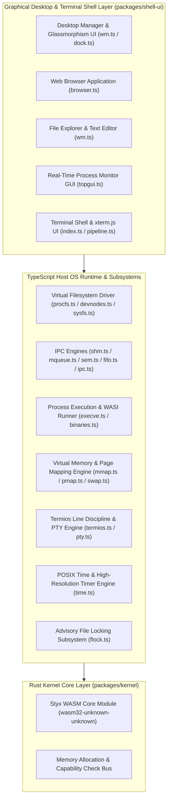

# System Architecture & Design

Styx OS (`Styx`) employs a decoupled dual-layer architecture consisting of a **Rust WebAssembly Core Engine** (`packages/kernel`) and a **TypeScript Host Shell & Graphical Web Desktop UI** (`packages/shell-ui`).

---

## 🏗 High-Level Architecture Diagram

---

## 🧩 Architectural Components

### 1. Rust WebAssembly Core (`packages/kernel`)
- Built using **Rust** and compiled with `wasm-pack`.
- Implements core memory allocation, capability validation, and low-level kernel primitives.
- Targets `wasm32-unknown-unknown`.

### 2. TypeScript OS Runtime & Kernel Subsystems (`packages/shell-ui/src/kernel`)
- **Virtual Filesystem (VFS)**: Mounts root `/`, `/bin`, `/dev`, `/proc`, `/sys`, `/etc`, `/tmp`, `/home/user`. Supports In-Memory VFS and OPFS (Origin Private File System) persistence.
- **Process & Binary Execution**: WASI process runner (`execve.ts`) executing compiled WebAssembly binaries in `/bin` (`/bin/hello.wasm`, `/bin/calc.wasm`, `/bin/curl.wasm`, `/bin/top.wasm`, `/bin/stty.wasm`, `/bin/mmap.wasm`, etc.).
- **Inter-Process Communication (IPC)**:
  - System V & POSIX Shared Memory (`shm.ts`).
  - POSIX Message Queues (`mqueue.ts`).
  - POSIX Named Semaphores (`sem.ts`).
  - POSIX Named Pipes / FIFOs (`fifo.ts`).
  - Unified IPC Inspector & Cleanup (`ipc.ts`).
- **Memory & Page Management**:
  - POSIX Memory Mapping (`mmap.ts`).
  - Memory Map Inspector (`pmap.ts`).
  - Virtual Swap Space (`swap.ts`).
- **Terminal & TTY Discipline**:
  - Pseudoterminal Master/Slave Devices (`pty.ts`, `/dev/ptmx`, `/dev/pts/0`).
  - Termios Line Discipline (`termios.ts`, `stty`, `tcgetattr`, `tcsetattr`).
- **Time & Timers**:
  - `CLOCK_REALTIME` and `CLOCK_MONOTONIC` (`time.ts`).
  - High-precision sleep (`nanosleep`).
  - POSIX timers (`timer_create`).

### 3. Glassmorphism Window Manager & Applications (`packages/shell-ui/src/shell`)
- **Window Manager (`wm.ts`)**: Manages window positioning, Z-index stacking, dragging, minimizing, maximizing, and closing.
- **Web Browser Window (`browser.ts`)**: Built-in graphical web browser rendering web pages, handling HTTP/HTTPS URLs, address bar, refresh, and iframe isolation.
- **File Explorer & Text Editor**: Double-click text file handler opening glassmorphism text editor with `Save` sync to VFS.
- **Real-Time Process Monitor GUI**: Visual process inspector showing PID, memory, CPU usage, and state.
- **xterm.js Terminal Shell**: Glassmorphism terminal container with ANSI TrueColor rendering, Tab auto-completion, and history navigation.
