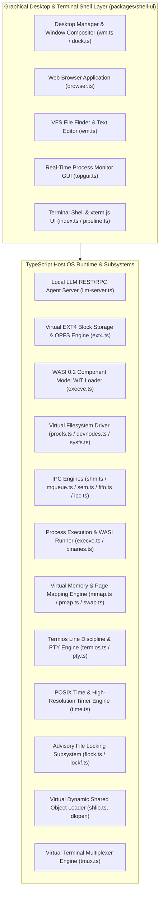

# System Architecture & Design

Styx OS (`Styx`) employs a microkernel architecture consisting of a **WebAssembly & TypeScript Core Runtime** (`packages/shell-ui`).

---

## High-Level Architecture Diagram

---

## Architectural Components

### 1. POSIX Microkernel Runtime & Kernel Subsystems (`packages/shell-ui/src/kernel`)
- **Virtual Filesystem (VFS)**: Mounts root `/`, `/bin`, `/dev`, `/proc`, `/sys`, `/etc`, `/tmp`, `/home/user`. Supports In-Memory VFS and OPFS (Origin Private File System) block persistence via `/dev/sda`.
- **Local LLM Agent Server**: OpenAI `/v1/chat/completions` REST API and WebSockets JSON-RPC (`ws://localhost:8080/rpc`).
- **Process & Binary Execution**: WASI 0.1 and WASI 0.2 Preview Component Model WIT runner (`execve.ts`).
- **Inter-Process Communication (IPC)**:
  - System V & POSIX Shared Memory (`shm.ts`).
  - POSIX Message Queues (`mqueue.ts`).
  - POSIX Named Semaphores (`sem.ts`).
  - POSIX Named Pipes / FIFOs (`fifo.ts`).
  - Shared Mutexes & Spinlocks (`mutex.ts`).
  - Record Byte-Range Locks (`lockf.ts`).
- **Memory & Page Management**:
  - POSIX Memory Mapping (`mmap.ts`).
  - Memory Map Inspector (`pmap.ts`).
  - Virtual Swap Space (`swap.ts`).
- **Terminal & TTY Discipline**:
  - Pseudoterminal Master/Slave Devices (`pty.ts`, `/dev/ptmx`, `/dev/pts/0`).
  - Terminal Session Multiplexer (`tmux.ts`).
  - Termios Line Discipline (`termios.ts`, `stty`).
- **Dynamic Linker Subsystem**:
  - Virtual Dynamic Shared Object Loader (`shlib.ts`, `dlopen`, `dlsym`, `dlclose`).

### 2. Desktop Window Manager & Applications (`packages/shell-ui/src/shell`)
- **Window Manager (`wm.ts`)**: Handles window positioning, layout grid snapping (`tile-left`, `tile-right`, `maximize`), glassmorphism filter toggles, dragging, and Z-index stacking.
- **Web Browser Window (`browser.ts`)**: Graphical web browser rendering web pages, handling HTTP/HTTPS URLs, address bar, refresh, and iframe isolation.
- **VFS File Finder Window (`wm.ts`)**: Interactive file search window with live text/regex search filtering and directory file previews.
- **Text Editor**: Text file handler opening text editor with `Save` sync to VFS.
- **Real-Time Process Monitor GUI**: Visual process inspector showing PID, memory, CPU usage, and state.
- **xterm.js Terminal Shell**: Terminal shell with ANSI TrueColor rendering, Tab auto-completion, and command history navigation.
